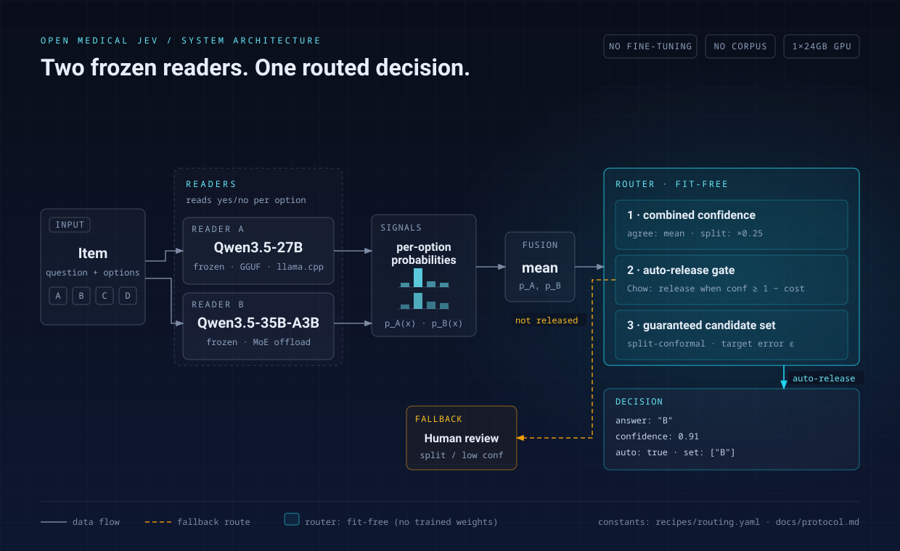
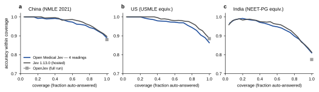

# Open Medical Jev（中文简介）

**用冻结的开源模型做 Jev 级判定——靠计算，不靠训练。**



Open Medical Jev 把两个**未做任何微调**的官方开源模型（[Qwen3.5-27B](https://huggingface.co/Qwen/Qwen3.5-27B)
与 [Qwen3.5-35B-A3B](https://huggingface.co/Qwen/Qwen3.5-35B-A3B) 的 GGUF 量化版）
当作"读数器"，在它们之上加一层小的路由计算：

* **合成置信度**——两个读数器一致时取概率均值，不一致时按实测折扣（×0.25）压低；
* **自动放行门**——Chow 规则：高置信自动放行，其余转人工复核；
* **保证型候选集**——split-conformal，按目标错误率给出带保证的候选集合
  （附可复现的重新校准流程）。

无微调、无蒸馏、无语料。仓库只发**代码 + 配方**。

> **与 Jev、OpenJev 同级的效果——全程零训练。** 600 题制三国执业医师卷：四读数完整配置在
> **三卷全部**距 Jev 2 个百分点以内（0.8883 / 0.8634 / 0.8100 vs 0.8967 / 0.8833 / 0.8133），
> 与 OpenJev 开源权重持平（中国/印度反超，美国卷 −2.2pp）；单卡 24GB 本地运行。无微调、无蒸馏、无语料。

**天然模型无关（升级路径）**：因为全程不训练，支持更新的开源模型 = 换读数器 + 快速重拟合两个路由常量（并在你自己的数据上复验）；协议、路由与保证原样沿用，无需任何重训流水线。

## 主要结果（模型完全未训练）

| 数据集 | 27B | 35B | 双模型均值融合 | 路由一致档 覆盖率@准确率 | Jev（托管） |
|---|---|---|---|---|---|
| dev-300（MedMCQA 子集） | 0.8000 | 0.7933 | **0.8167** | 78.7% @ 0.9025 | 0.8300 |
| JevBench（公开，70/72） | 0.8143 | 0.7857 | 0.8143 | 82.9% @ 0.9310 | 0.9860 |
| jev-decision-bench（916 题） | 0.8395 | 0.8046 | 0.8373 | 87.1% @ 0.8697 | ~0.86 |

### 三国执业医师卷（各 600 题；模型完全未训练）

| 系统 | 中国（NMLE 2021 真题） | 美国（USMLE 等价卷） | 印度（NEET-PG 等价卷） |
|---|---|---|---|
| Jev 1.13.0（云 API） | 0.8967 | 0.8833 | 0.8133 |
| OpenJev（开源权重 Q4，本地跑） | 0.8800 | 0.8850 | 0.7750 |
| **本项目 — 四读数**（双读数器 × 双读数结构） | **0.8883** | **0.8634** | **0.8100** |
| 本项目 — 27B（单读数器） | 0.8767 | 0.7437 | 0.7900 |
| 本项目 — 35B-A3B（单读数器） | 0.8667 | 0.7352 | 0.7533 |

美/印为固定种子等价卷；美国卷 593/600 可读；用时为逐题纯计算（我们 0.27–0.31 秒/题，本地单卡；
Jev API ≈1.02 秒/题）。三方均过及格线（60% / 60% / 50%）。四读数行运行全部读数（双读数器 × 双读数结构），单题计算量高于单读数器行。



<sub>**覆盖率–准确率**（三国 600 题卷；a 中国=真实 2021 真题，b/c 美/印=固定种子等价卷）。曲线按各自系统的逐题置信度排序：x=自动作答比例，y=该比例内准确率。「四读数」= 双读数器 × 双读数结构，按各读数实测准确率定权合成（无训练）。OpenJev 无逐题置信度，以全卷成绩单点标出。Jev 云服务在最高精度档仍领先；接近全量覆盖时两者收敛。完整口径见 [reports/results_summary.md](reports/results_summary.md)。</sub>

校准后（1 参数、按档温度缩放）：jdb 的 ECE 达 **0.0096**（同基准 Jev 公开值 0.027，约 3 倍优）；
中国考试卷 Conformal 四档全达标（ε=0.20 时集合=1，即给唯一答案）。
完整表格、口径与边界见 [reports/results_summary.md](reports/results_summary.md)。

## 快速开始

```bash
scripts/setup_env.sh            # 环境 + 自检（核心零第三方依赖）
scripts/download_models.sh q4   # 下载两个 GGUF（国外网络/镜像说明见 docs/deploy.md）
scripts/serve_model.sh 27b      # 127.0.0.1:10361
scripts/serve_model.sh 35b      # 127.0.0.1:10362（MoE 部分专家放 CPU，单卡 24GB 可跑）
scripts/quickstart.sh           # 端到端演示
```

自己的数据（JSONL 格式见 [docs/protocol.md](docs/protocol.md)）：

```bash
python -m open_medical_jev evaluate --items mydata.jsonl \
    --servers http://127.0.0.1:10361,http://127.0.0.1:10362 --out results/run1
```

## 边界说明

* 研究软件，非医疗器械，不得用于诊断或治疗（见 `NOTICE`）。
* 不发布语料、真题、逐题数据与任何训练产物（见 [DATA_POLICY.md](DATA_POLICY.md)）。
* 本项目的开发使用了 AI 编码助手（LLM agents）深度协助；仓库内报告的全部数字可由随附脚本与固定配方复算。
* 校准常量与某个分布绑定；换分布要重新校准（见 protocol/evaluation 文档）。
* 本项目独立，与 TypeSafe（Jev）、OpenJev、Medical-OpenJev、MedJev、ClinicalJev 等均无关联；
  生态关系见 [docs/comparison.md](docs/comparison.md)。

## 许可

MIT（[LICENSE](LICENSE)、[NOTICE](NOTICE)）。底座模型为阿里/Qwen 团队的 Apache-2.0
开源模型，GGUF 量化来自 Unsloth 的 HF 仓库，llama.cpp（MIT）为本地推理运行时——均不随本仓库打包分发。
